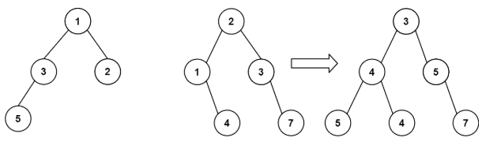
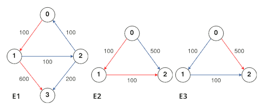

# Assignment 2

There are 16 questions in all, 7 of which are tagged as
**[PY]**{: .htag }.  You are required to submit
solutions to **only** 10 questions, 5 of which should
have been tagged as **[PY]**{: .htag }.

Solutions to the questions tagged as **[PY]**{: .htag }
shall be a python function.  Other questions are more
conceptual in nature, and their solutions may be an
algorithm/ pseudocode/ python function, as per your
discretion.

[For submission details, click
here.](#submission-details)

## Question 1 ##
Given the following undirected graph, perform a BFS as
well as DFS starting from vertex $A$. List the order in
which the vertices are visited.

$\{A-B,\; A-C,\; B-D,\; C-D,\; D-E\}$

## Question 2 ##

Given the following directed graph, **algorithmically**
determine if it is a DAG. If it is not, explain why.

$\{A\to B,\; B\to C,\; C\to A,\; B\to D\}$

## Question 3 ##

Given the following DAG, **algorithmically** perform a
topological sort.  

$\{A\to B,\; A\to C,\; B\to D,\; C\to D\}$

## Question 4 **[PY]**{: .htag } ##

Given a weighted vertex graph $G(V,E)$, a start node
$s$ and a target sum $\sigma$.

**Write an algorithm, or equivalently a python program
(WAP)** to inspect if there is a path from $s$ such
that adding up all the vertex weights along the path,
equals the target sum.

Note: $\forall v \in V\; \exists v.w$ that
represents vertex weights.

## Question 5 ##

WAP to traverse [a binary tree](#binary-tree "Glossary
for Binary Tree") using BFS.  Illustrate with necessary
examples.

## Question 6 **[PY]**{: .htag } ##

Given two binary trees, $A,B$, WAP to compute a merge
operation defined as follows:

Imagine that one is put on to cover the other; some
nodes overlap, while others don’t.  The merge rule
states that for each position in the binary tree, if
two nodes overlap, the value of the merged node is
their sum; otherwise, it’s the value of not null
node. _E.g._

## Question 7 ##

If the following paths completely describe a given
**undirected** graph, show one possible order of nodes
visited through BFS.

$M-N-O-P-Q$  
$N-Q-M-R$

## Question 8 ##

Given a binary tree, $B$ find its min, max and average
depths.

**PS:** Depth of a tree is defined by the distance of
leaf nodes from the root, not that of any intermediary
nodes.

## Question 9 **[PY]**{: .htag } ##

Given an image $M\in\mathbb{Z}^{H\times W}$ represented
as a grid (or matrix) of $H\times W$ of integers, where
$m_{ij}$ represents the pixel value of $i$-th row,
$j$-th column.

1. WAP to flood-fill colour $\kappa$ starting at pixel
   at $r$-th row and $c$-th column.
   
2. Reflect on the relative merits of using BFS/DFS for
   the process.

**Flood Fill**

* Flood fill is a process to change the colour of a
  contiguous region, by starting with a given source
  pixel and expanding along the neighbours until a
  boundary is hit.
* Region is defined by colour of the start pixel.
* Neighbours shares a boundary (either vertically or
  horizontally).
* A neighbour with colour different than that of the
  start pixel is deemed to be a boundary; it’s colour
  is left untouched!
  
[LeetCode #733][LC733]

## Question 10 ##

Given an undirected graph $G(V,E)$ without
[self-loops](#loop), and a pair $(s,d)$ of source and
destination vertices, determine if a path between them
exists in the graph.

## Question 11 **[PY]**{: .htag } ##

**Evaluate a Boolean Binary Tree**

Given a full binary tree $B$ such that,

+ Leaf nodes bear binary truth values, i.e. `True` or
  `False`; and 
+ Non leaf nodes bear values that represent logic
  gates, namely `AND` or `OR`.
  
WAP to evaluate the boolean binary tree $B$ and return
the result.

## Question 12 **[PY]**{: .htag } ##

**Island Perimeter**

Given a binary rectangular grid $M\in\{0,1\}^{H\times
W}$ with $H$ rows and $W$ columns, where each pixel
$m_{ij}$ represents either $0$ for water or $1$ for
land.  Assume that

1. There’s exactly one island (contiguously connected
   land cells);
2. Pixels are connected either vertically or
   horizontally but not diagonally; and
3. There are no lakes.

WAP to determine the perimeter of the island!

[LeetCode #463][LC463]

## Question 13 **[PY]**{: .htag } ##

Given $N$ courses labelled $\{0,\ldots,N-1\}$ and a
list of prerequisites $R$ such that the courses
$R[i]\equiv\{a_i,b_i,\ldots\}$ are required to be
completed before enrolling for $i$-th course.

WAP to determine if all the $N$ courses can be
completed successfully by a candidate.  If so, also
determine one of the feasible ordering of courses.

**Examples**

1. $N=2$, $R=[\emptyset,\{0\}]$ means that course $1$
   requires course $0$ as pre-requisite.  Hence, it is
   possible to complete the courses, in the following
   order: $[0,1]$.
2. $N=2$, $R=[\{1\},\{0\}]$. Here, the requirement is
   $1$ before $0$; and also $0$ before $1$.  This,
   hence, is impossible.

## Question 14 ##

Given a [DAG](#dag) $G(V,E)$, WAP to determine the list
of ancestors for each node.

## Question 15 **[PY]**{: .htag } ##

There are $N$ cities, connected by flights.  Given the
list of flights $F\equiv\{(s_i,d_i,p_i):0<i\leqslant
N\}$ so that $i$-th flight connects the source city
$s_i$ to destination city $d_i$ for a cost-price of
$p_i$.

Given $A,B,k$, WAP to determine **the cheapest price**
to connect city $A$ to city $B$ with maximum $k$ stops.

**Examples** (Optimal paths marked in red)

1. $N=4, F\equiv\{ (0,1,100), (1,2,100), (2,0,100),
   (2,3,200) \}, A=0, B=3, k=1$  
   Result: $700$
2. $N=3, F\equiv \{ (0,1,100), (1,2,100), (0,2,500) \},
   A=0, B=2, k=1$  
   Result: $200$
2. $N=3, F\equiv \{ (0,1,100), (1,2,100), (0,2,500) \},
   A=0, B=2, k=0$  
   Result: $500$

## Question 16 ##

There’s a dungeon arranged as a grid of $N\times M$
rectangular rooms.

$T\in\mathbb{Z}^{N\times M}$ represents for each room
$(i,j)$, a threshold of **minimum** time $t_{ij}$
starting from which a **move into** it may be
initiated.

**Move** is allowed only between two **adjacent** rooms
that share a common *vertical* or *horizontal* wall,
and each move takes **1 unit** time duration.

WAP to start from room $(0,0)$ and finally determine
the minimum time required to reach the room
$(N-1,M-1)$.

**Examples**

1. $T=[[0,4],[4,4]]$  
   Result: $6$  
   Explanation:  
   $t=4: (0,0)\to(1,0)$;  
   $t=5: (1,0)\to(1,1)$.
2. $T=[[0,0,0],[0,0,0]]$  
   Result: $3$  
   Explanation:  
   $t=0: (0,0)\to(1,0)$;  
   $t=1: (1,0)\to(1,1)$;  
   $t=1: (1,1)\to(1,1)$.
2. $T=[[0,1],[1,2]]$  
   Result: $3$  
   Explanation:  
   $t=1: (0,0)\to(1,0)$;  
   $t=2: (1,0)\to(1,1)$.

[LeetCode #3341][LC3341]

## Submission Details ##

**[TODO]**{: .htag }

## Glossary ##

### Loop ###

An edge from a vertex to its own self.

### Binary Tree ###

A directed graph, where

+ There’s a fixed start node called **root**;
+ Each node may have upto two children; and
+ The node with no children is called a **leaf**.

### Full Binary Tree ###

A binary tree where each node has either two or no children

### DAG ###

(Directed Acyclic Graph)

A directed graph, where there are no back-edges.

*[WAP]: Write a program or equivalently a python program
*[DAG]: Directed Acyclic Graph
*[BFS]: Breadth First Search
*[DFS]: Depth First Search
*[PY]: Submit the solution as Python Function

[LC733]: https://leetcode.com/problems/flood-fill/ "LeetCode Problem #733"

[LC463]: https://leetcode.com/problems/island-perimeter/ "LeetCode Problem #463"

[LC3341]: https://leetcode.com/problems/find-minimum-time-to-reach-last-room-i "LeetCode Problem #3341"

[LOOP]: https://en.wikipedia.org/wiki/Loop_(graph_theory) "Loop in Graph Theory"
